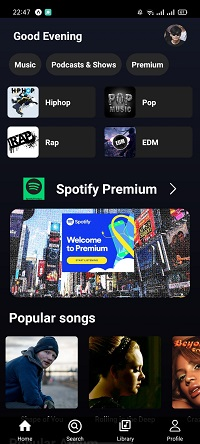
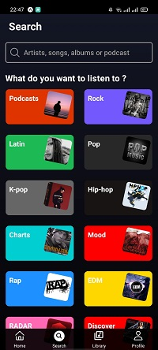
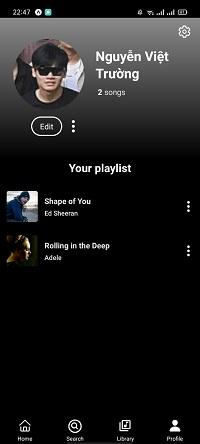

# Spotify: UI Clone with React Native / Expo

  
  

  
  

## Table of Contents
  - [Install \& Build](#install--build)
  - [Features](#features)
  - [Technologies](#technologies)

## Install & Build

First, make sure you have Expo CLI installed: `npm install -g expo-cli`

**Create a new React Native project**
- Step 1: Open the terminal run command [`npx create-expo-app --template`]
- Step 2: Run command [`npx expo start`] or [`npm start`]
- Step 3: Scan the QR code above with Expo Go (Android) or the Camera app (iOS)

**JSON-server**
- Step 1: Install JSON-server with [`npm install json-server`]
- Step 2: Run command [`npx json-server --host 0.0.0.0 --port 5000 --watch (json file)`]
- Note: Note: Replace [json file] with your JSON file's name.
- Important: Use your IPv4 address and update the IPv4 variable in the source code to start the JSON-server.

## Features

- Expo SDK 49
- iOS, Android
- React Navigation
- React Context
- PropTypes

## Technologies
- React Native
- Expo
- JSON-server(FAKE API)
- TailwindCSS
- Nodejs(developing)
